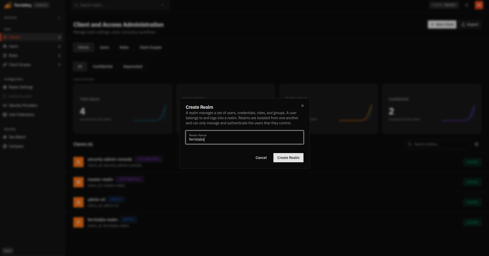
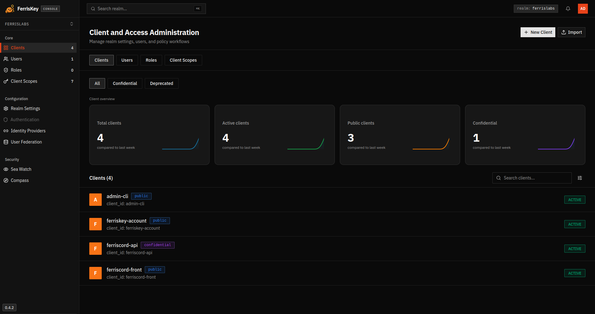
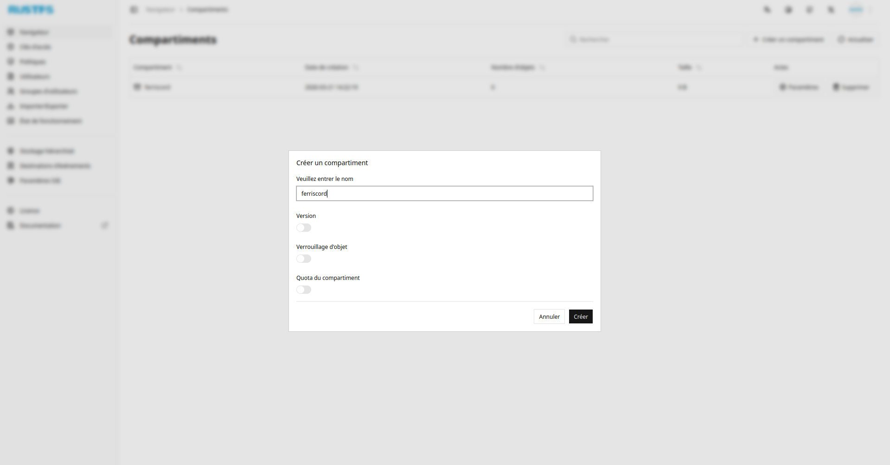
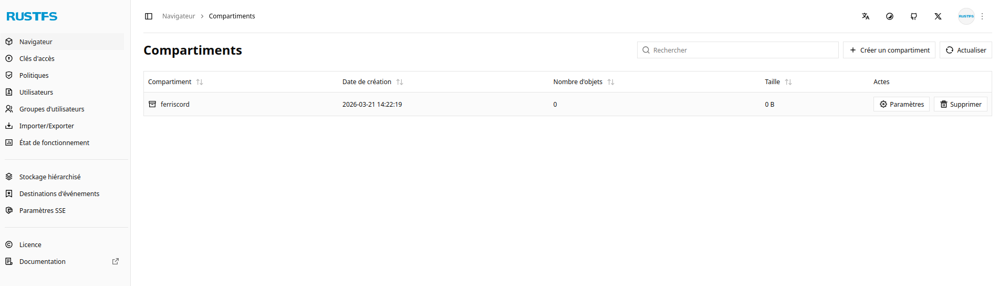

# FerrisCord — Setup Guide

This guide walks you through the initial setup of FerrisCord's external services: **FerrisKey** (OIDC identity provider) and **RustFS** (S3-compatible file storage).

## Prerequisites

Start the services with Docker Compose:

```bash
# Start FerrisCord (API, webapp, Postgres, RustFS)
docker compose up -d

# Start FerrisKey (OIDC identity provider)
docker compose --profile ferriskey up -d
```

Services will be available at:
- **FerrisKey Console:** http://localhost:7555 (admin / admin)
- **RustFS Console:** http://localhost:9001 (minioadmin / minioadmin)

> **Note:** Port `7333` is the FerrisKey OIDC endpoint used by the app for authentication — it is not the admin console.

---

## Step 1 — FerrisKey: Create the `ferrislabs` realm

Open the FerrisKey console at http://localhost:7555 and log in as `admin`.

From the **Client and Access Administration** page, click **New Realm** and enter `ferrislabs` as the realm name, then click **Create Realm**.



---

## Step 2 — FerrisKey: Create the two clients

Still in FerrisKey, navigate to the **ferrislabs** realm and go to **Clients**. Create the following two clients:

| Client ID         | Type         | Description                        |
|-------------------|--------------|------------------------------------|
| `ferriscord-api`  | Confidential | Backend API (server-to-server auth)|
| `ferriscord-front`| Public       | Frontend SPA (browser-based OIDC)  |

Once both clients are created, your client list should look like this:



> **Note:** After creating `ferriscord-api`, copy its **client secret** from the client's settings page and set it as `AUTH_CLIENT_SECRET` in your `.env` file.

---

## Step 3 — FerrisKey: Create a user

In the **ferrislabs** realm, go to **Users** and click **New User**. Fill in the required fields (username, email) and set a password in the **Credentials** tab.

This user will be your first FerrisCord account.

---

## Step 4 — RustFS: Create the `ferriscord` bucket

Open the RustFS console at http://localhost:9001 and log in.

Go to **Navigator → Buckets** and click **+ Create bucket**. Enter `ferriscord` as the bucket name and click **Create**.



The bucket will appear in the list once created:



> **Note:** Go to **Access Keys** in RustFS to generate an access key and secret key, then update `STORAGE_ACCESS_KEY_ID` and `STORAGE_SECRET_ACCESS_KEY` in your `.env` file.

---

## Summary of `.env` values to update

After completing the steps above, make sure your root `.env` contains:

```env
AUTH_ISSUER=http://localhost:7333/realms/ferrislabs
AUTH_CLIENT_ID=ferriscord-api
AUTH_CLIENT_SECRET=<secret from ferriscord-api client>

STORAGE_ENDPOINT=http://localhost:9000
STORAGE_ACCESS_KEY_ID=<generated in RustFS>
STORAGE_SECRET_ACCESS_KEY=<generated in RustFS>
```

And your `webapp/.env`:

```env
VITE_OIDC_ISSUER_URL=http://localhost:7333/realms/ferrislabs
VITE_OIDC_CLIENT_ID=ferriscord-front
VITE_API_URL=http://localhost:7001
```

Once configured, run the API and frontend — you're ready to go.
